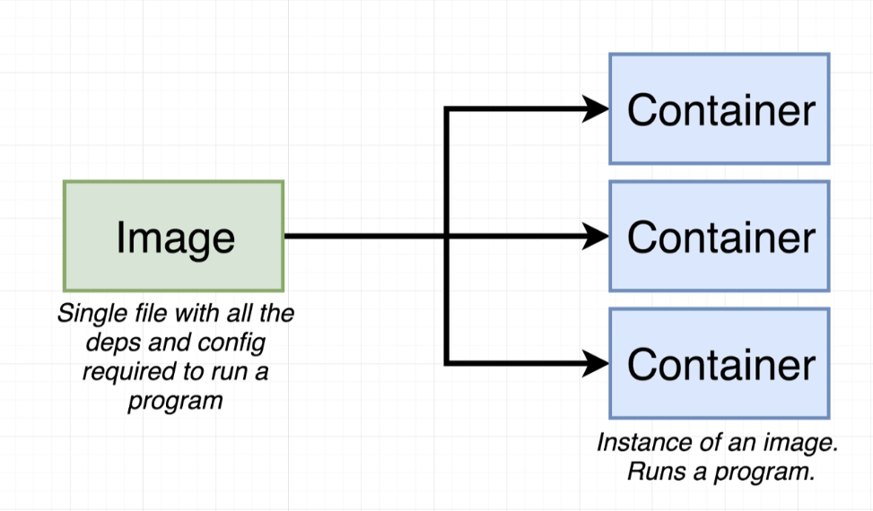
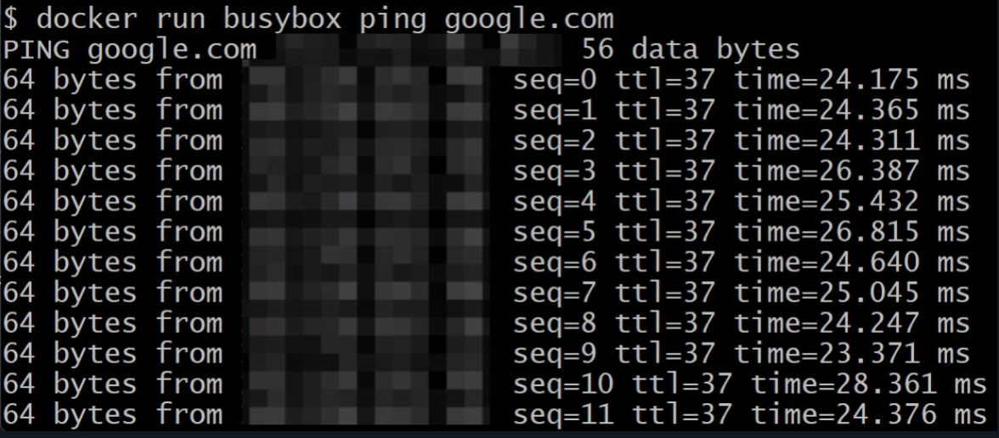
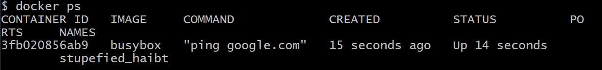

# Introducation

## What is a Microservice?

- Until now I have been creating a full stack application that was not so huge and scalable, but still was built using a single database, and the server and its components were not broken down into services.
- A single microservice contains a single feature of our app. And that should be completely independent of other features. So that if any of them bugs out our whole application will not crash.
- The main point to be taken care of is data management b/w microservices.
- The two ways to manage the issue are Sync and Async.
- Sync - Services communicate with each other using direct request
  - If the dependent service fails then all the parent services will also fail which are somehow connected with the main/parent service
- Async - Services communicate with each other using events
  - One of the ways is to use Data Bus
  - And the better way is to create a new database that will listen to the Data bus whenever an entity is updated.
    - The interesting thing here is, if other services go down, it won't affect this new service.
    - There might be some delay due to this method, Eg in YouTube live subscriber count, and subscriber count on the YT page are different, as they are not being updated simultaneously. Of course, it is not this simple YouTube has a much more complex system.
- Docker - We create a series of things called **container**.
  - Container - It's like an *isolated computing environment*, it contains everything required to run one single program.
  - That's what is called a Docker Container
  - Eg:- Container for different services in an App like Posts, Comments, Moderation, Event-Bus, Query, etc.
  - Docker makes it easy to run and install a software without worrying about it's setup of dependencies.
  - Docker have and Image and a container.
  - A Docker image is a file used to execute code in a Docker container
    
  - In simple words a image is like a *repository* which we can clone/download/cache/use in our local machine from **Docker Hub**(Like *GitHub*).
  - The command to do this is
    - `docker run <image name> <command>`
    - The `command` is a action, which we can justify after the image name. It should be present in the container to run successfully.
  - For viewing current running container
    - For running a container use `docker run busybox ping google.com`
    
     
    - `docker ps`
    
  - `docker ps --all` will show all the container ever created and run.
  - (`docker run`) = (`docker create`) + (`docker start -a`)
  - `docker system prune` is the command to delete all the container, image, and cache present in your local machine.
  - To stop the docker container we have :-
    - `docker stop <id>` will give some time, to save/easily quit the container. If it take more than 10 sec `docker kill <id>` will automatically execute
    - `docker kill <id>` will immediately quit/kill/stop/force stop the container
    - `docker exec -it <container id> <command>` by this you will be able to add a new command in pre existing container
    - `docker exec -it <container id> sh` to open a new shell window inside a container.
- Kubernetes - It's a tool for running a bunch of different containers together
  - It is going to create these containers that are going to run our program for us, and it's going to handle communication or network requests between all these containers.
  - In simple words, it's a tool for simplifying communication between different containers/programs.
